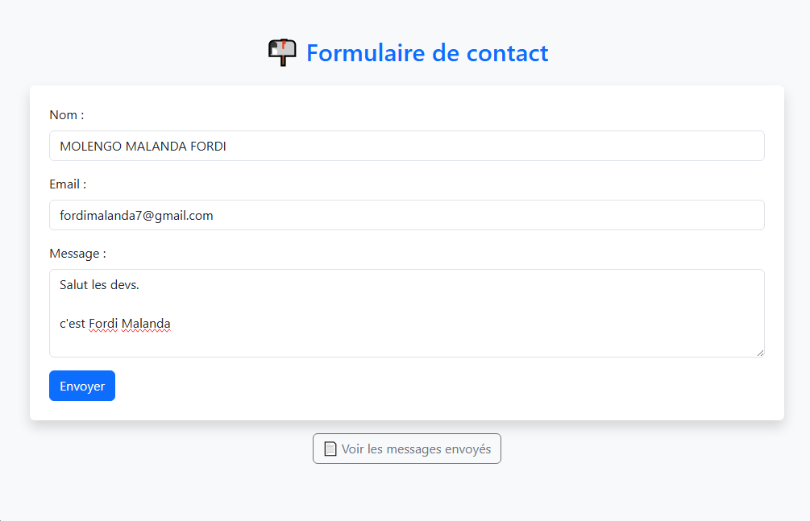
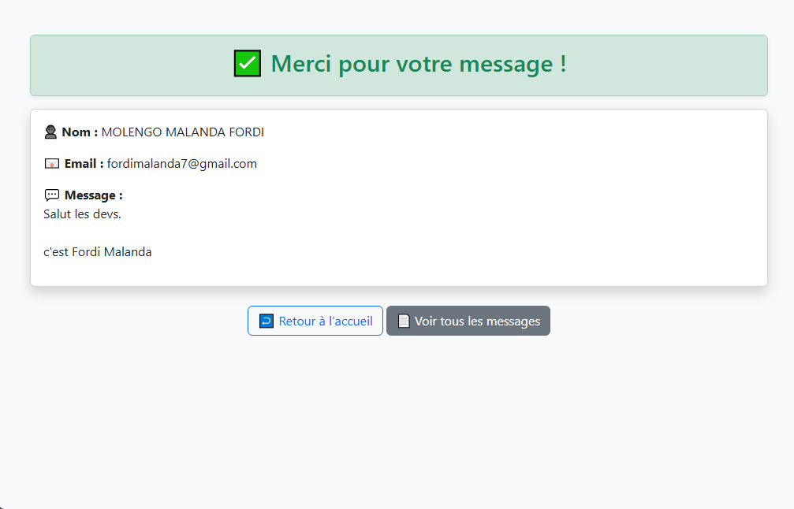
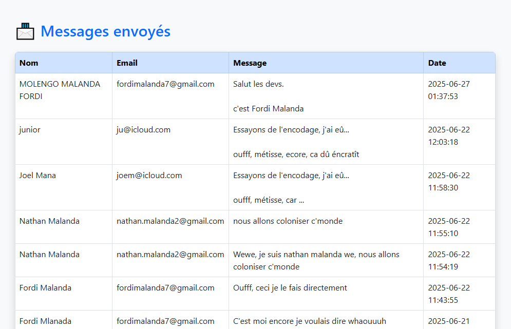
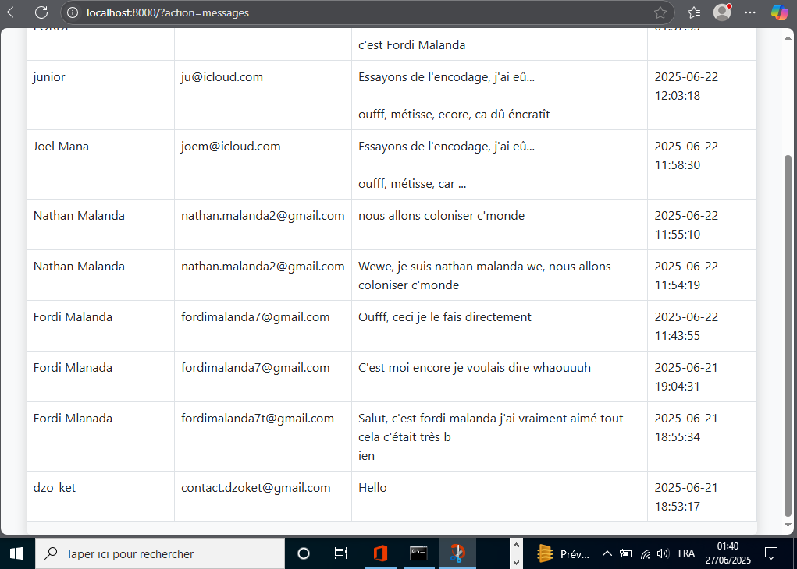

# 📬 Formulaire de contact MVC en PHP

Ce projet est une petite application PHP conçue pour illustrer l'utilisation de l'architecture **MVC**, la **programmation orientée objet (POO)**, et **PDO** pour la communication avec MySQL — sans dépendre de phpMyAdmin.

🧰 Technologies utilisées :
- PHP 8+
- MySQL Community Server (ligne de commande)
- PDO pour la base de données
- Bootstrap 5 pour le design


---

## ⚙️ Configuration requise

- PHP 8.1 ou supérieur
- MySQL Community Server
- Serveur local (ex: `php -S localhost:8000`)

---

## 🧪 Installation

1. Clone le dépôt :
   ```bash
   git clone https://github.com/fordimalanda/contact-form.git
   cd contact-form
   ```

---

## 🎨 Aperçu de l’application

### 📄 Formulaire de contact


### ✅ Message envoyé


### 📬 Liste des messages




